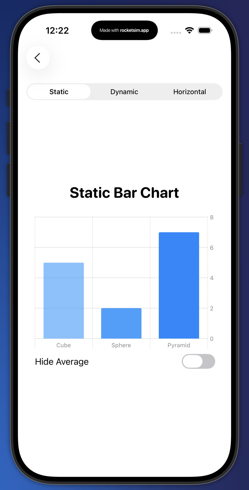
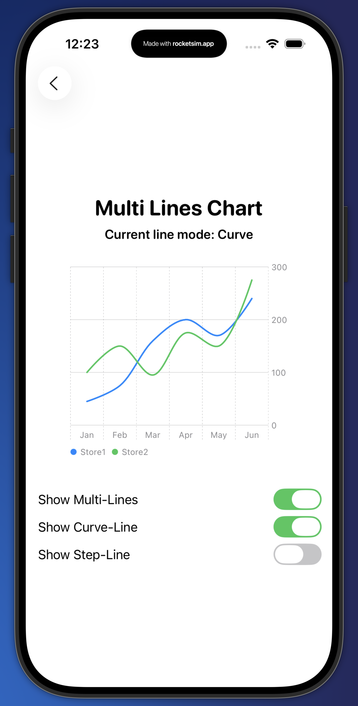
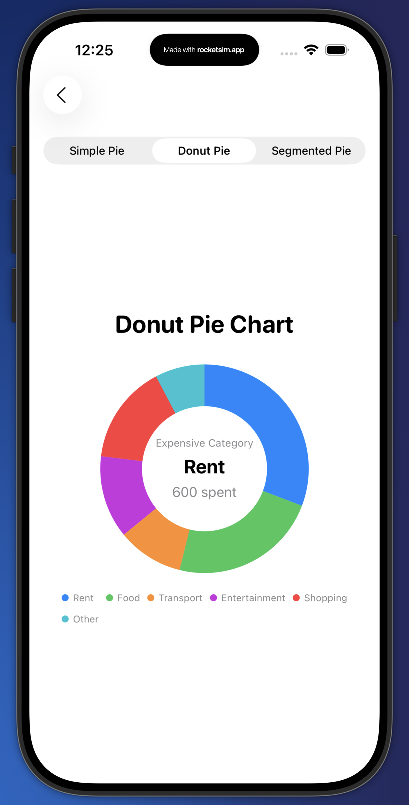
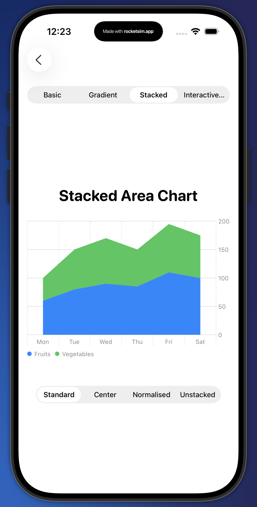
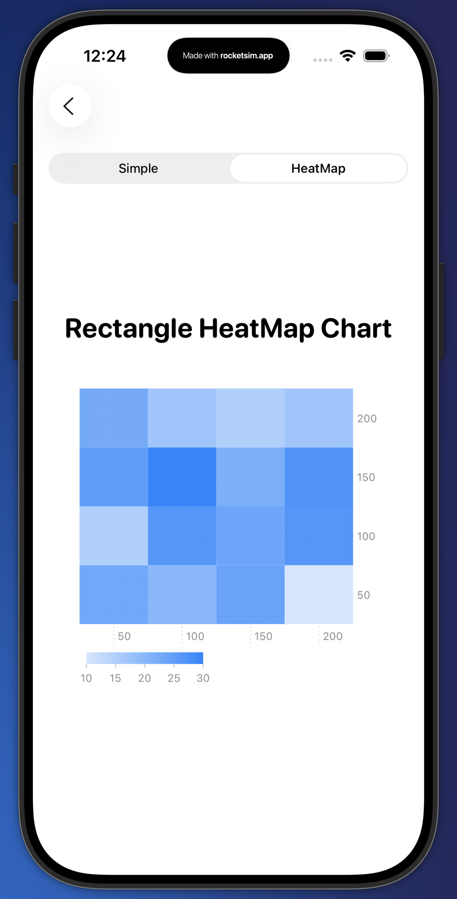
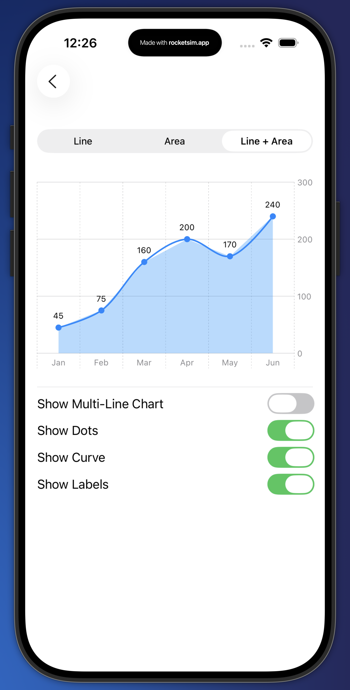
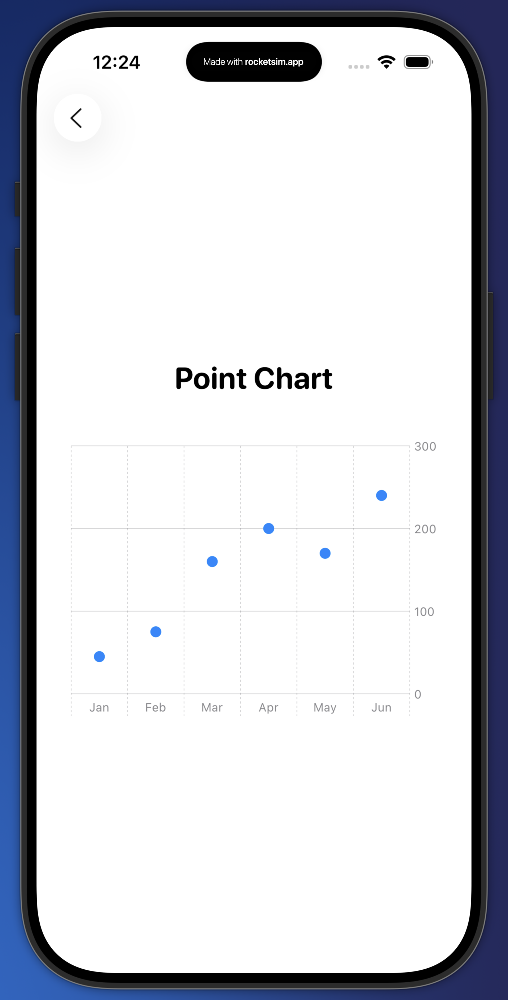
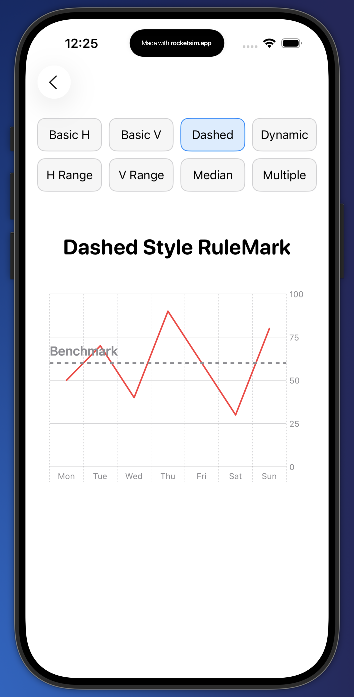

# Swift Charts

An iOS SwiftUI app showcasing practical examples of Apple’s Swift Charts, including Bar, Line, Area, Point, Pie, Rectangle (heatmap), RuleMark overlays, and combined Line+Area+Points charts with interactive controls.

---

## 🎬 Demo

| Swift Charts Demo |
|------------------------------|
|  |

---

## 🖼️ Screenshots

> Add screenshots from your project to visually highlight the charts.

| Bar Chart | Line Chart | Pie / Donut |
|-----------|------------|-------------|
|  |  |  |

| Area Chart | Rectangle / Heatmap | Combined Chart |
|------------|---------------------|----------------|
|  |  |  |

| Point Chart | RuleMark Chart |
|-------------|----------------|
|  |  |

---

## ⚙️ Tech

* **SwiftUI**, **Swift Charts** (`import Charts`)
* **Minimum iOS**: iOS 16+
* **Xcode**: 16.x or newer (project created with tools version 26.0)

---

## ✅ Features

### 📊 Bar Charts

* Static, dynamic (time-based), and horizontal
* Average overlays & annotations
* Category-based color mapping

### 📈 Line Charts

* Single + multi-series
* Interpolation modes: linear, Catmull‑Rom, step
* Symbol + label annotation support

### 📉 Area Charts

* Gradient + stacked
* Interactive selection with chart overlay + proxy

### 🔹 Point Charts

* Scatter‑style
* Supports symbol size + annotation

### 🍩 Pie & Donut

* Segmented slices + legend support
* Donut center-label showing highest spend category

### 🟥 Rectangle Charts / Heatmap

* Bar‑like rectangles with dimensions
* Heat map via `RectangleMark` with explicit start/end & color encoding

### 📏 RuleMark Examples

* Horizontal/vertical rules
* Dashed/min/max/median indicators
* Range overlays

### 🔀 Combined: Line + Area + Points

* Toggle-driven composition
* Modes: Line / Area / Line+Area
* Optional dots, curve, labels

---

## 🛠 Notes

* Uses minimal abstraction to showcase raw Swift Charts concepts
* Each example separated for learning clarity
* Great reference for beginners → intermediate Swift Charts developers

---

## 🤝 Contributing

PRs + issues welcome!

